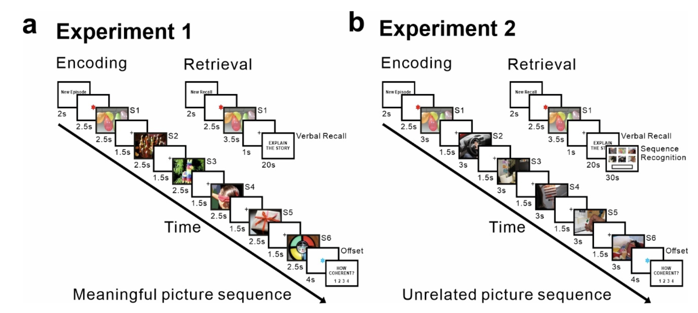

# Post-encoding Reactivation Is Related to Learning of Episodes in Humans

Code of the paper *Post-encoding Reactivation Is Related to Learning of Episodes in Humans* (Xiongbo Wu, 2022)

## Abstract

Prior animal and human work have shown that post-encoding reinstatement plays an
important role in organizing the temporal sequence of unfolding episodes in memory. Here,
we investigated whether post-encoding reinstatement serves to promote the encoding of
‘one-shot’ episodic learning beyond the temporal structure in humans. In experiment 1,
participants encoded sequences of pictures depicting unique and meaningful episodic-like
events. We used representational similarity analysis on scalp electroencephalography
recordings during encoding and found evidence of rapid picture elicited EEG patterns
reinstatement at episodic offset (around 500ms post-episode). Memory reinstatement was
not observed between successive elements within an episode and the degree of memory
reinstatement at episodic offset predicted later recall for that episode. In experiment 2,
participants encoded a shuffled version of the picture sequences from experiment 1,
rendering each episode meaningless to the participant but temporally structured as in
experiment 1, and we found no evidence of memory reinstatement at episodic offset. These
results suggest that post-encoding memory reinstatement is akin to the rapid formation of
unique and meaningful episodes that unfold over time.

## Experiments

- Task design in Experiment 1. During encoding, 100 different sequences were presented only once. Each sequence included 6 different pictures that unfold a life-like coherent narrative episode. Each picture was presented 2.5s, followed by a 1.5s fixation cross. After each sequence of images, there was an offset period (4s) during which participants were instructed to avoid rehearsing the just- encoded picture sequence. Participants were asked to provide a subjective rating of episodic coherence to the just encoded sequence at the end of each trial. Retrieval task was conducted 10-15 minutes after encoding. During retrieval, the first picture of each sequence was presented for 3.5 s which was followed fixation cross, and a message prompted at the screen instructing to report the associated episode during encoding. Participants were asked to verbally report within 20 seconds their memory associated episode or to indicate whether no memory came up associated to that picture cue. 

- Task design in Experiment 2. Pictures were shuffled across sequences so that no meaningful story could be constructed after each sequence presentation. 60 shuffled sequence series were selected. The procedure was identical to Experiment 1 except two adjustments for task difficulty: 1. Time duration for the presentation of each picture during encoding was increased to 3000ms; 2. After each cued-picture recall task, participants were requested to perform a sequence order recognition task within 30 seconds, during which all 6 pictures from the same sequence series (including the cue picture) were presented on the screen in random positions and participants were asked to type the order of them as the original sequence presented during encoding phase.

## Project structure

- `/scripts`: Contains the MATLAB scripts used to perform the analyses described in the paper.

  - `corr_matrix.m`: This script calculates correlation matrices used in the representational similarity analysis.
    
  - `fast_corr.m`: A utility script for efficiently computing correlations, used by other scripts to speed up the processing of EEG data.
  
  - `RSA_encISI_Exp1.m`: Performs representational similarity analysis for the inter-stimulus intervals (ISIs) during encoding in Experiment 1. This script specifically looks for memory reinstatement between the successive elements within each episode.
  
  - `RSA_encoffset_Exp1.m`: Analyzes the EEG patterns at the offset of encoding each episode in Experiment 1, checking for rapid reinstatement that predicts later recall performance.
  
  - `RSA_Exp1_vs_Exp2.m`: Compares the results of representational similarity analysis between Experiment 1 and Experiment 2, focusing on the effects of episode shuffling on memory reinstatement.

## Citation

> Wu, X., Viñals, X., Ben-Yakov, A., Staresina, B. P., & Fuentemilla, L. (12 2022). Post-encoding Reactivation Is Related to Learning of Episodes in Humans. Journal of Cognitive Neuroscience, 35(1), 74–89. doi:10.1162/jocn_a_01934
